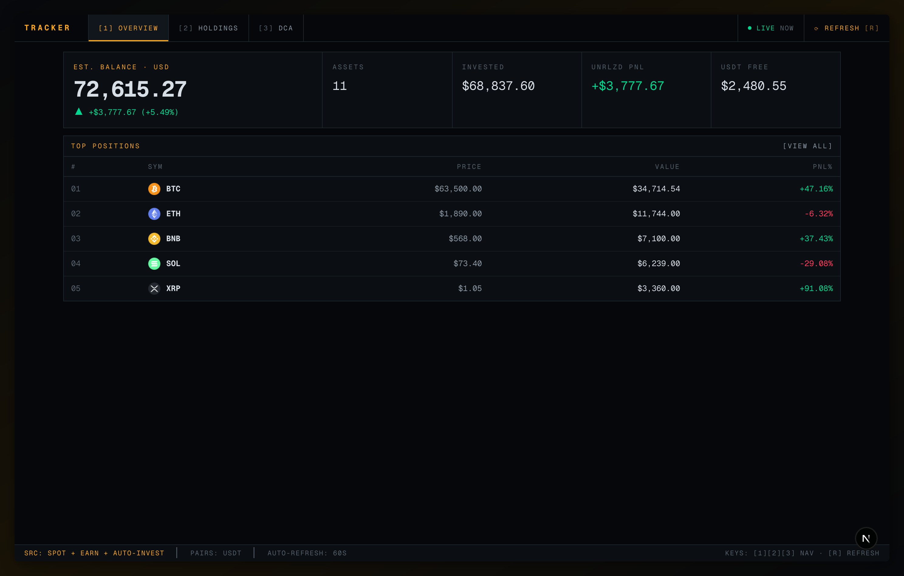
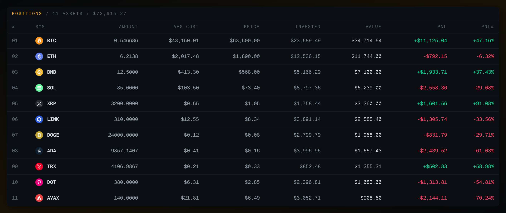
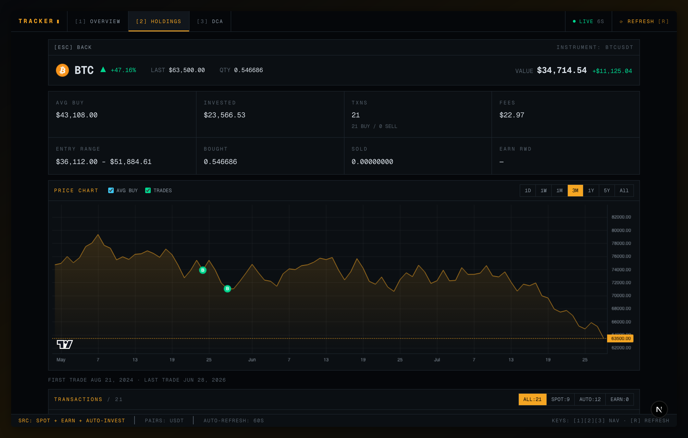
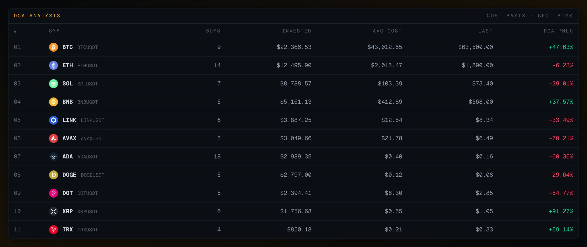
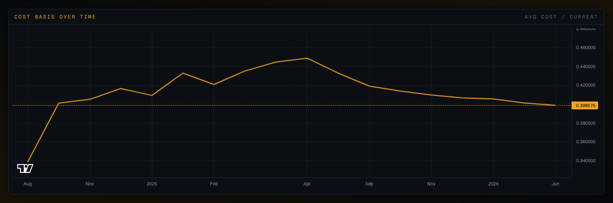

# Binance Account Tracker

A personal portfolio dashboard for tracking Binance spot holdings, earn positions, auto-invest plans, and DCA cost basis analysis — presented as a Bloomberg-style trading terminal. Built with Next.js, TypeScript, and Tailwind CSS.



## Features

- **Overview** — Estimated balance, unrealized PnL, and top positions in a tiled panel grid
- **Holdings** — Dense positions table with amount, avg cost, invested, value, and PnL per asset
- **Holding Detail** — Per-asset instrument readout with price chart (lightweight-charts), avg-buy line, trade markers, and unified transaction history (spot / auto-invest / earn rewards)
- **DCA Analysis** — Cost basis over time for spot buys: running avg cost chart, stats, and buy history with per-transaction cost basis
- **Wrapped asset folding** — Staked assets like WBETH are folded into their underlying asset (ETH) at the market price ratio, so cost basis and PnL come from the actual buy history
- **Terminal UX** — Monospace type, panel grid layout, live price auto-refresh (60s), and keyboard navigation

### Keyboard shortcuts

| Key | Action |
|---|---|
| `1` / `2` / `3` | Switch to Overview / Holdings / DCA |
| `R` | Full refresh |
| `Esc` | Back to list |

## Screenshots

> All screenshots are generated from **mocked data** (`npm run screenshots`) — no real account data.

### Holdings



### Holding Detail

Price chart with avg-buy line and trade markers, plus unified transaction history:



### DCA Analysis



Per-asset cost basis over time:



## Prerequisites

- Node.js 18+
- A Binance account with API keys (read-only permissions are sufficient)

## Setup

1. **Clone the repository**

   ```bash
   git clone https://github.com/sodinfeliz/binance-acc-tracker.git
   cd binance-acc-tracker
   ```

2. **Install dependencies**

   ```bash
   npm install
   ```

3. **Configure environment variables**

   Copy the example env file and fill in your keys:

   ```bash
   cp .env.example .env
   ```

   Then edit `.env` with your Binance API credentials.

   > **Binance API key setup:** Go to [Binance API Management](https://www.binance.com/en/my/settings/api-management), create a new key, and enable **only "Read" permissions**. No trading or withdrawal access is needed.

4. **Run the development server**

   ```bash
   npm run dev
   ```

   Open [http://localhost:3000](http://localhost:3000) in your browser.

## Production Build

```bash
npm run build
npm start
```

## Screenshots Script

Regenerate the README screenshots with:

```bash
npm run dev                # in one terminal
npm run screenshots        # in another (BASE_URL=http://localhost:3000 by default)
```

The script (`scripts/capture-screenshots.mjs`) drives the app with Playwright and intercepts every `/api/*` request in the browser, serving a deterministic fictional portfolio (BTC, ETH, and other top-20 alts) — your real account data is never rendered or captured.

## API Routes

All data is fetched server-side through Next.js API routes — your API keys are never exposed to the browser.

| Route | Description |
|---|---|
| `/api/account` | Spot wallet balances |
| `/api/earn` | Simple Earn (flexible + locked) positions |
| `/api/trades` | Spot trade history per symbol |
| `/api/auto-invest` | Auto-invest / index plan transaction history |
| `/api/earn-rewards` | Earn dividend/reward history |
| `/api/prices` | Current ticker prices |
| `/api/klines` | Candlestick / price chart data |

## Tech Stack

- **Next.js 16** (App Router)
- **React 19**
- **TypeScript**
- **Tailwind CSS 4**
- **lightweight-charts** (TradingView) for price and cost basis charts
- **Playwright + sharp** for README screenshot generation
